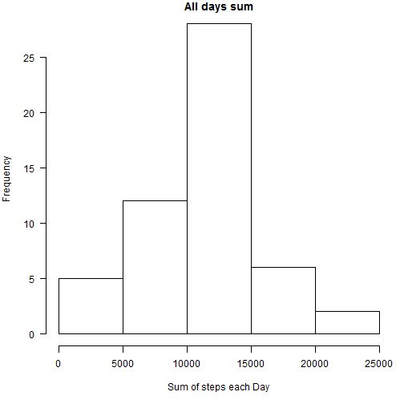
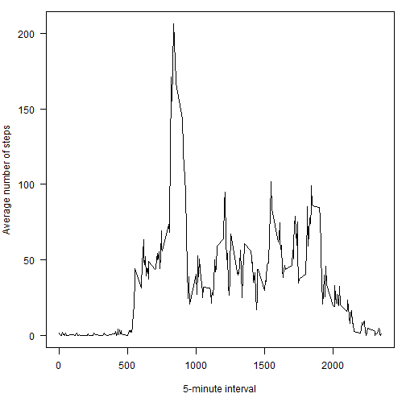
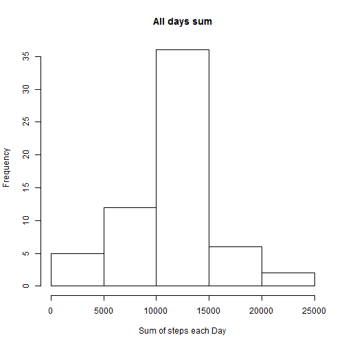
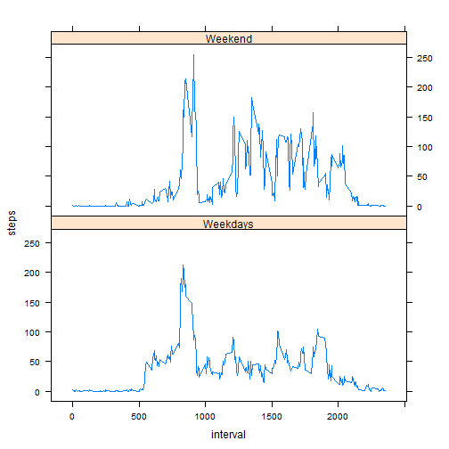

Assignment 1
========================================================

##Loading and preprocessing the data
For this purpose first load the data from "activity.csv" file
into activity data.frame. After this step we clean data from 
NA values


```r
activity <- read.csv("activity.csv")
good <- complete.cases(activity)
activity_clean <- activity[good, ]
library(data.table)
activity_table <- data.table(activity[good, ])
```


After preprocessing step we calcuate total number of steps taken per day

```r
all_days_sum <- activity_table[, list(sum_of_steps_each_day = sum(steps)), by = date]
```

Mean of above calcuated "all days sum"

```r
mean(all_days_sum$sum_of_steps_each_day)
```

```
## [1] 10766
```

Median of above calcuated "all days sum"

```r
median(all_days_sum$sum_of_steps_each_day)
```

```
## [1] 10765
```


Then we Plot a histogram of the total number of steps taken each day

```r
par(mar = c(5, 4, 1, 1), las = 1)
hist(all_days_sum$sum_of_steps_each_day, main = "All days sum", xlab = "Sum of steps each Day")
```

 


After that we will find the average daily activity pattern by making a time series plot (type = "l") of the 5-minute interval on x-axis and the average number of steps taken across all days on y-axis.

First we will calcuate the x-axis and y-axis values as follow,

```r
vec = 0
interval_average_steps = 0
k = 1
totalDays = length(seq(1, length(activity_table$steps), by = 288))

for (i in 1:288) {
    for (j in seq(i, length(activity_table$steps), by = 288)) {
        vec[k] = activity_table$steps[j]
        k = k + 1
    }
    k = 1
    avrg = sum(vec)/totalDays
    interval_average_steps[i] = avrg
}

intervel <- activity_table$interval[1:288]
```


Then the time series plot will be drawn as follows

```r
par(mar = c(5, 4, 1, 1), las = 1)
plot(intervel, interval_average_steps, xlab = "5-minute interval", ylab = "Average number of steps", 
    type = "l")
```

 


Now To find out Which 5-minute interval contains the maximum number of steps on average across all the days in the dataset we will do the following

Maximum 5-minutes interval:    

```r
activity_table$interval[which(interval_average_steps == max(interval_average_steps))]
```

```
## [1] 835
```


The original data, data before preprocessing consists of Missing values as shown NA in the dataset.
There are following number of datasets rows which consists of missing values

```r
sum(is.na(activity))
```

```
## [1] 2304
```


    
Imputing missing values:
The original data set in the preprocessing step consits of missing values. The presence of missing days may introduce bias into some calculations or summaries of the data. We will deal with these missing values by putting the average of total number of days we alreay have calculated in initial steps.

```r
impute <- unique(activity$date[is.na(activity$steps)])

for (i in 1:length(impute)) {
    rep <- which(activity$date == impute[i])
    activity$steps[rep[1]:rep[length(rep)]] = interval_average_steps
}
```


We Create a new dataset "impune_data" that is equal to the original dataset but with the missing data filled in as in the above process.


```r
impune_data <- data.table(activity)
```

    
Now again we will calcuate the total number of steps taken each day and Calculate as follows,
    

```r
total_steps_new <- impune_data[, list(sum_all_days = sum(steps)), by = date]
```


Then we will Make a histogram of the total number of steps taken each day

```r
hist(total_steps_new$sum_all_days, main = "All days sum", xlab = "Sum of steps each Day")
```

 

 The we calcuate the mean total number of steps taken per day.

```r
mean(total_steps_new$sum_all_days)
```

```
## [1] 10766
```

and then median of total number of steps taken per day.

```r
median(total_steps_new$sum_all_days)
```

```
## [1] 10766
```


We can easily see that the mean and median of datasets before and after missing values is very less differences


Are there differences in activity patterns between weekdays and weekends?


    Create a new factor variable in the dataset with two levels - "weekday" and "weekend" indicating whether a given date is a weekday or weekend day.

    Make a panel plot containing a time series plot (i.e. type = "l") of the 5-minute interval (x-axis) and the average number of steps taken, averaged across all weekday days or weekend days (y-axis). The plot should look something like the following, which was creating using simulated data:

First we will add a new column name days, which shows the that the day is either weekday or weekend,
The process will be carried out as following  


```r
impune_data$days <- "Weekdays"

impute_new <- unique(activity$date)

for (i in 1:length(impute_new)) {
    if (weekdays(as.Date(impute_new[i])) == "Saturday" || weekdays(as.Date(impute_new[i])) == 
        "Sunday") {
        rep <- which(impune_data$date == impute_new[i])
        impune_data$days[rep[1]:rep[length(rep)]] = "Weekend"
    }
}
```

    Note:
    In case of localization one part of the graph shows missing (at least in my case), which is not an error. To run correctly change the name of Saturday and sunday with corresponding local names and everything will work fine(e.g. if you are working with German Windows then the names of Saturday and Sunday will changed into Samstag and Sonntag respectively and then graps will show correctly).

Then weekdays and weekends data plot is shown below

```r
library(lattice)
final_data <- aggregate(steps ~ interval + days, data = impune_data, mean)
xyplot(steps ~ interval | days, data = final_data, layout = c(1, 2), type = "l")
```

 

